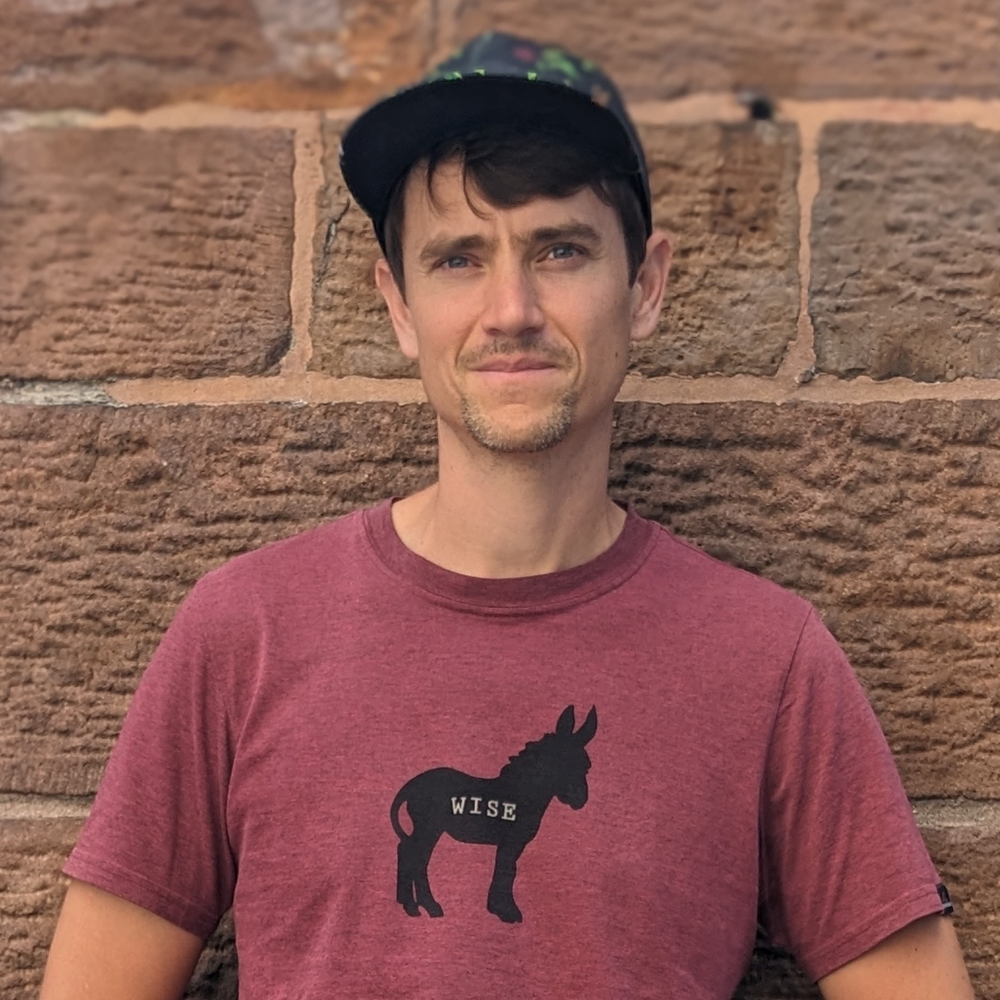

I am a research scientist at [EPFL](https://www.epfl.ch) in [Distributed Information Systems Laboratory](https://www.epfl.ch/labs/lsir/). I did my PhD working on deep learning models for natural language processing with [Ronan Collobert](https://ronan.collobert.com) at the [Idiap Research Institute](https://www.idiap.ch/).

> The real hero of programming is the one who writes negative code.

## Selected Publications

- Karoui Y., **Lebret R.**, Foroutan N., and Aberer K. [Stop Pre-Training: Adapt Visual-Language Models to Unseen Languages](https://github.com/Yasminekaroui/CliCoTea). In _ACL'23_.
- Foroutan N., Banaei M., **Lebret R.**, Bosselut A., and Aberer K. [Discovering Language-neutral Sub-Networks in Multilingual Language Models](https://github.com/negar-foroutan/multiLMs-lang-neutral-subnets). In _EMNLP'22_.
- Liu F., **Lebret R.**, Orel D., Sordet P., and Aberer K. [Upgrading the Newsroom: An Automated Image Selection System for News Articles](https://arxiv.org/abs/2004.11449). In _ACM Transactions on Multimedia Computing, Communications, and Applications (Vol. 16)_.
- Harkous H., Fawaz K., **Lebret R.**, Schaub F., Shin K. G., and Aberer K. [Polisis: Automated analysis and presentation of privacy policies using deep learning](https://www.usenix.org/conference/usenixsecurity18/presentation/harkous). In _USENIX Security'18_.
- Gupta A., **Lebret R.**, Harkous H., and Aberer K. [Taxonomy Induction using Hypernym Subsequences](https://arxiv.org/abs/1704.07626). In _CIKM'17_.
- **Lebret R.**, Grangier D., and Auli M. [Neural Text Generation from Structured Data with Application to the Biography Domain](https://aclanthology.org/D16-1128/). In _EMNLP'16_.
- **Lebret R.**, Iovleff S., Langrognet F., Biernacki C., Celeux G., and Govaert G. [Rmixmod: The R Package of the Model-Based Unsupervised, Supervised, and Semi-Supervised Classification Mixmod Library](https://www.jstatsoft.org/article/view/v067i06). In _Journal of Statistical Software (Vol. 67)_.
- **Lebret R.**, Pinheiro P. O., and Collobert R. [Phrase-based Image Captioning](https://proceedings.mlr.press/v37/lebret15). In _ICML'15_.
- **Lebret R.** and Collobert R. [Word Embeddings through Hellinger PCA](https://aclanthology.org/E14-1051/). In _EACL'14_.

## Typography

This is a [link](http://google.com). Something _italics_ and something **bold**.

Here is a table

| Year | Award     | Category                                              |
| ---- | --------- | ----------------------------------------------------- |
| 2014 | Emmy      | Won Outstanding Lead Actor in a miniseries or a movie |
| 2015 | BAFTA     | Nominated for Best Leading Actor for Sherlock         |
| 2014 | Satellite | Won Best Actor miniseries or television film          |

Here is a horizontal rule

---
